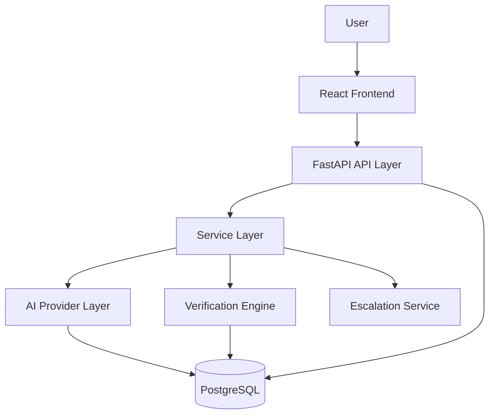
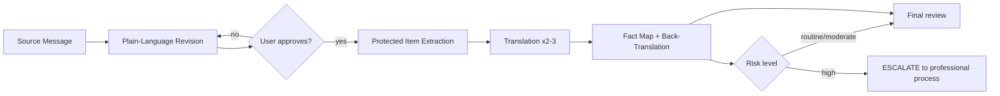

# Multilingual Communication Assistant

**Reach every family in their language.**

An open-source, AI-assisted communication quality and translation platform for
schools, districts, and community organisations. It helps you turn a routine
message into a clear, welcoming source, translate it into 2–3 languages, and
**verify** that dates, deadlines, actions, and contact paths survived
translation — before a single family reads it.

It is deliberately *not* a "text translator". The product is a
**verification-first writing and translation pipeline**.

> **This tool never claims a translation is certified or guaranteed accurate.**
> For high-consequence content (safety, health, legal rights, discipline,
> disability services, emergencies) it stops and routes to your organisation's
> approved professional translation or interpretation process.

---

## Table of Contents

- [Why this exists](#why-this-exists)
- [Features](#features)
- [The BRIDGE workflow](#the-bridge-workflow)
- [Architecture](#architecture)
- [Tech stack](#tech-stack)
- [Quick start](#quick-start)
- [Environment setup](#environment-setup)
- [Running with Docker](#running-with-docker)
- [Using the mock provider offline](#using-the-mock-provider-offline)
- [Using a real AI provider](#using-a-real-ai-provider)
- [API overview](#api-overview)
- [Testing](#testing)
- [Project structure](#project-structure)
- [Security](#security)
- [Privacy](#privacy)
- [Contributing](#contributing)
- [Roadmap](#roadmap)
- [License](#license)

---

## Why this exists

A friendly reminder written in one language can become a *warning* in another.
A deadline of **October 3** silently becomes **October 8**. "May attend" becomes
"must attend". Fluency hides meaning loss.

This project therefore treats a translation as **unverified** until it has been
checked against a machine-generated **fact map**, back-translated, and assigned
a **risk level**. Human review is a first-class step, not an afterthought.

## Features

| Area | What it does |
| --- | --- |
| **Plain-language rewriting** | Short sentences, concrete verbs, explicit actions and deadlines, welcoming tone. Returns a structured *what changed / why* summary. |
| **Approval gate** | Translation is impossible until a human approves the revised source. The API refuses non-approved sources. |
| **Protected-item extraction** | Deterministic regex pass **plus** AI pass to find names, dates, times, numbers, URLs, emails, phone numbers, program names, deadlines, actions and conditions. |
| **Placeholder-preserving translation** | Protected items are masked as `‹P1›`-style placeholders before the model call and restored afterwards. |
| **Fact map / verification table** | `Item \| Source \| Translation \| Status` for every critical fact, with `PASS` / `WARNING` / `FAIL` / `REVIEW_REQUIRED`. |
| **Back-translation** | Critical action / deadline / condition lines are re-translated to English and diffed against the approved source. |
| **Risk classification** | `ROUTINE` / `MODERATE` / `HIGH`, with keyword + context reasoning shown to the user. |
| **Escalation** | `HIGH` risk messages are returned flagged as `ESCALATED` and never presented as final. |
| **PII screening** | Detects likely real names, emails, and phone numbers and warns; examples use placeholders only. |
| **Provider abstraction** | `mock` (offline), `openai`, and any OpenAI-compatible local server (Ollama, vLLM, LM Studio). |
| **Demo mode** | Fictional, de-identified sample messages bundled with the repo. |
| **Observability** | Structured logs with request ID, operation, duration, provider, outcome — never message bodies by default. |

## The BRIDGE workflow

| Step | Action | Why it matters |
| --- | --- | --- |
| **B** | Begin with purpose | Name audience, purpose, action, deadline, contact path. The translator needs the reader's context. |
| **R** | Rewrite plainly | Short sentences, concrete verbs, defined terms, scannable structure. |
| **I** | Identify protected items | Names, dates, URLs, phone numbers, program names that must remain exact. |
| **D** | Draft with context | Language, locale, tone, reading level, format. Translation is contextual, not substitution. |
| **G** | Gauge meaning | Compare key facts and actions; back-translate critical lines; inspect tone. |
| **E** | Escalate when needed | The greater the consequences of an error, the more thorough the verification. |

**The greater the consequences of an error, the more thorough the verification.**

### Accuracy layers

| Layer | Question | Example risk |
| --- | --- | --- |
| Factual | Are names, dates, numbers, links, conditions unchanged? | RSVP deadline shifts from October 3 to October 8. |
| Semantic | Does the translation carry the same meaning and action? | "May attend" becomes "must attend". |
| Pragmatic | Will the audience read the purpose and tone as intended? | A friendly reminder becomes a warning. |
| Terminological | Are recurring terms consistent and locally appropriate? | "Conference" becomes a large convention. |
| Functional | Can the recipient actually use the message and respond? | The link label is dropped. |

### Risk levels and required review

| Level | Examples | Minimum review |
| --- | --- | --- |
| `ROUTINE` | Welcome note, event reminder, classroom update | AI draft + fact check + bilingual review when available |
| `MODERATE` | Permission request, schedule change, participation instructions | Approved workflow + fluent reviewer; confirm response path |
| `HIGH` | Safety, health, legal rights, discipline, disability services, emergencies | **Do not rely on AI alone** — use the approved professional process |

---

## Environment setup

All configuration is environment-driven. Copy `.env.example` to `.env`.

| Variable | Default | Purpose |
| --- | --- | --- |
| `APP_ENV` | `development` | Runtime environment |
| `LOG_LEVEL` | `INFO` | Log verbosity |
| `LOG_MESSAGE_CONTENT` | `false` | **Keep `false` in production** — controls whether message bodies are logged |
| `DATABASE_URL` | Postgres URL | SQLAlchemy async URL; swap for `sqlite+aiosqlite:///./app.db` |
| `CORS_ORIGINS` | `http://localhost:5173` | Comma-separated allowlist |
| `AI_PROVIDER` | `mock` | `mock` \| `openai` \| `local` |
| `OPENAI_API_KEY` | *(empty)* | Required only when `AI_PROVIDER=openai` |
| `OPENAI_MODEL` | `gpt-4o-mini` | Chat model |
| `LOCAL_BASE_URL` | `http://localhost:11434/v1` | Ollama / vLLM / LM Studio base URL |
| `LOCAL_MODEL` | `llama3.1` | Local model name |
| `DATA_RETENTION_DAYS` | `30` | Retention window for stored workspaces |

`.env` is git-ignored. **Never commit it.**

---

## Running with Docker

```bash
cp .env.example .env
docker compose up --build
```

| Service | URL |
| --- | --- |
| Frontend (nginx) | <http://localhost:3000> |
| Backend API | <http://localhost:8000> |
| Swagger | <http://localhost:8000/docs> |
| PostgreSQL | `localhost:5432` |

Useful targets: `make up`, `make down`, `make logs`, `make db-shell`.

---

## Using the mock provider offline

`AI_PROVIDER=mock` needs no API key and no network. It performs:

- rule-based plain-language simplification using a curated phrase table,
- glossary-based translation for the bundled languages,
- deterministic protected-item handling via placeholders,
- deterministic back-translation for the verification pass.

This exists so contributors can run, demo, and test the **entire** pipeline
offline. It is a rule engine, not a neural model — do not use it for real
outreach.

## Using a real AI provider

```dotenv
AI_PROVIDER=openai
OPENAI_API_KEY=sk-...
OPENAI_MODEL=gpt-4o-mini
```

Or fully local / open-source:

```dotenv
AI_PROVIDER=local
LOCAL_BASE_URL=http://localhost:11434/v1
LOCAL_MODEL=llama3.1
```

No code changes are required — the provider is chosen by configuration through
`app/ai/factory.py`.

---

## API overview

Full reference: [`docs/api.md`](docs/api.md). Interactive docs at `/docs`.

| Method | Endpoint | Purpose |
| --- | --- | --- |
| `GET` | `/api/health` | Liveness, DB connectivity, active AI provider |
| `GET` | `/api/languages` | Supported target languages |
| `GET` | `/api/risk-levels` | Risk level definitions and review requirements |
| `POST` | `/api/messages` | Create a workspace from a source message |
| `GET` | `/api/messages` | List recent workspaces |
| `GET` | `/api/messages/{id}` | Fetch a workspace with all stages |
| `POST` | `/api/messages/rewrite` | Plain-language rewrite + change summary |
| `POST` | `/api/messages/{id}/approve` | **Approval gate** — human approves the revision |
| `POST` | `/api/messages/{id}/reject` | Send the revision back with feedback |
| `GET` | `/api/messages/{id}/protected-items` | Extracted protected items |
| `POST` | `/api/translations` | Translate an **approved** message into 2–3 languages |
| `GET` | `/api/translations/{id}` | Fetch a translation record |
| `POST` | `/api/verification` | Generate a verification report for a translation |
| `GET` | `/api/verification/{id}` | Fetch a verification report |
| `POST` | `/api/escalation/check` | Classify risk and return escalation guidance |
| `GET` | `/api/examples` | Bundled fictional demo messages |
| `DELETE` | `/api/messages/{id}` | Delete a workspace (privacy right) |

Errors use a consistent envelope and never expose stack traces:

```json
{ "error": { "code": "SOURCE_NOT_APPROVED", "message": "..." }, "request_id": "..." }
```

---

## Testing

```bash
make test          # backend + frontend
make test-backend  # pytest
make test-frontend # vitest
```

Or directly:

```bash
cd backend && pytest -q
cd frontend && npm run test
```

The backend suite covers the normal case, missing deadlines, ambiguous
wording ("Return the form soon"), date mismatch (September 8 → September 9),
time mismatch (8:30 a.m. → 8:00 a.m.), high-risk escalation, PII placeholders,
and a full mock-provider integration run.

---

## Project structure

```
multilingual-communication-assistant/
├── backend/
│   ├── app/
│   │   ├── main.py               # thin app factory
│   │   ├── api/                  # routes + dependencies
│   │   ├── core/                 # config, logging, security, languages
│   │   ├── models/               # SQLAlchemy ORM
│   │   ├── schemas/              # Pydantic I/O models
│   │   ├── services/             # orchestration
│   │   ├── ai/                   # provider abstraction + prompts
│   │   ├── verification/         # pure verification engine
│   │   └── db/                   # session + migrations
│   ├── alembic/
│   ├── tests/
│   ├── requirements.txt
│   └── pyproject.toml
├── frontend/
│   ├── src/{components,pages,services,hooks,types}
│   └── package.json
├── docs/
├── examples/
├── .github/
├── docker-compose.yml
├── Makefile
└── .env.example
```
---

## Security

- No secrets in source control; configuration via environment variables only.
- Restricted CORS allowlist.
- Parameterised SQLAlchemy access — no string interpolation into queries.
- Input validation on every endpoint via Pydantic.
- Generic, user-safe error messages; details logged server-side.
- Request-ID middleware for traceability.
- Dependencies pinned in `requirements.txt`.

Full policy: [`SECURITY.md`](SECURITY.md).

> The reference app ships **without authentication** so it is easy to review and
> run. Put it behind an authenticated reverse proxy before exposing it.

## Privacy

- No real student or family data anywhere in this repository.
- All bundled examples are fictional and de-identified, using placeholders such
  as `[FAMILY NAME]`, `[PHONE]`, `[PROGRAM COORDINATOR]`.
- Message bodies are **not** written to logs unless you opt in.
- Incoming text is screened for likely personal data and the user is warned.
- Workspaces can be deleted via `DELETE /api/messages/{id}`; `DATA_RETENTION_DAYS`
  documents the intended retention window.

## Contributing

See [`CONTRIBUTING.md`](CONTRIBUTING.md) and
[`CODE_OF_CONDUCT.md`](CODE_OF_CONDUCT.md). The short version: small focused
changes, type hints, tests for new behaviour, no secrets, no real personal data.

## Roadmap

- [x] BRIDGE pipeline with a non-skippable approval gate
- [x] Provider abstraction (`mock` / `openai` / `local`)
- [x] Deterministic fact-map verification and back-translation
- [x] Risk classification and escalation
- [x] React Communication Workspace
- [x] Docker + CI
- [ ] Locale-specific terminology glossaries from community reviewers
- [ ] User accounts, teams, and shared glossaries
- [ ] Human reviewer sign-off workflow and audit trail
- [ ] Readability / grade-level scoring in the verification report
- [ ] Additional languages (Arabic, French, Portuguese, Somali, Tagalog, Vietnamese)
- [ ] Professional translation vendor handoff format (XLIFF / JSON export)
- [ ] Optional read-aloud of the final message

## License

[MIT](LICENSE) © Aquib2004.


---

## Architecture



### Request flow (the approval gate is non-skippable)



### Backend layers

| Layer | Package | Responsibility |
| --- | --- | --- |
| API | `app/api` | HTTP routing, Pydantic schemas, status codes, OpenAPI |
| Service | `app/services` | Orchestration and business workflow (approval state machine, translation, verification, escalation) |
| AI | `app/ai` | Provider abstraction, prompts, structured output validation |
| Verification | `app/verification` | Pure, deterministic fact extraction, comparison, back-translation, risk classification |
| Persistence | `app/models`, `app/db` | SQLAlchemy ORM models, session management, migrations |
| Core | `app/core` | Settings, logging, security helpers, language registry |

The verification engine is **pure Python with no AI dependency**, so it is
fully testable and behaves identically offline.

---

## Tech stack

**Frontend** — React 18, TypeScript (strict), Vite, Tailwind CSS, React
Router, TanStack Query, Vitest + React Testing Library, ESLint + Prettier.

**Backend** — Python 3.11+, FastAPI, Pydantic v2, SQLAlchemy 2.0, Alembic,
psycopg, structlog, pytest, pytest-asyncio, Ruff, Black, mypy.

**AI** — pluggable `AIProvider` interface: `mock`, `openai`, `local`
(any OpenAI-compatible endpoint). Selected purely by configuration.

**Database** — PostgreSQL in Docker/production, SQLite fallback for
zero-infrastructure local development and CI.

---

## Quick start

### Prerequisites

- Python **3.11+**
- Node.js **18+**
- *(optional)* Docker + Docker Compose

### 1. Clone

```bash
git clone https://github.com/Aquib2004/multilingual-communication-assistant.git
cd multilingual-communication-assistant
```

### 2. Backend

```bash
cd backend
python -m venv .venv
# Windows:        .venv\Scripts\activate
# macOS / Linux:  source .venv/bin/activate

pip install -r requirements.txt

cp ../.env.example ../.env          # Windows: copy ..\.env.example ..\.env
```

The default `.env` uses the **mock** provider and a **SQLite** database, so no
API key and no database server are required.

```bash
uvicorn app.main:app --reload --port 8000
```

- API: <http://localhost:8000>
- Swagger UI: <http://localhost:8000/docs>
- ReDoc: <http://localhost:8000/redoc>
- Health: <http://localhost:8000/api/health>

### 3. Frontend

```bash
cd frontend
npm install
npm run dev
```

Open <http://localhost:5173>.
