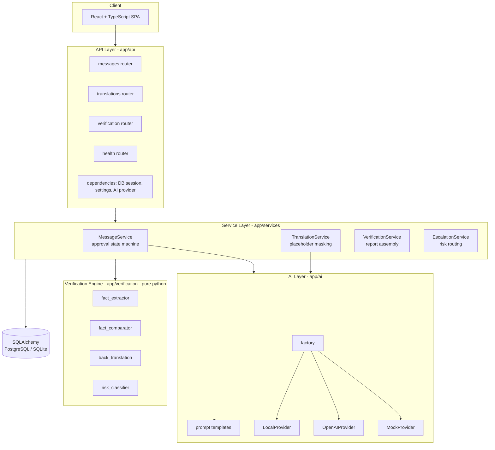
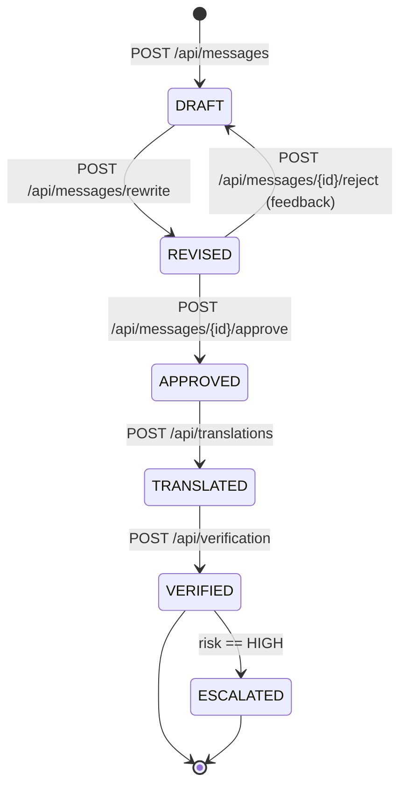
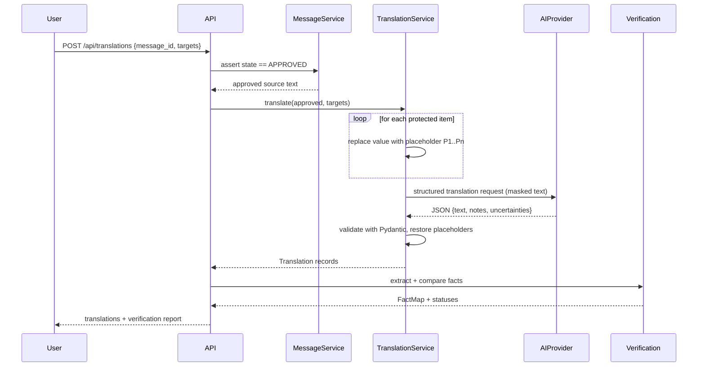
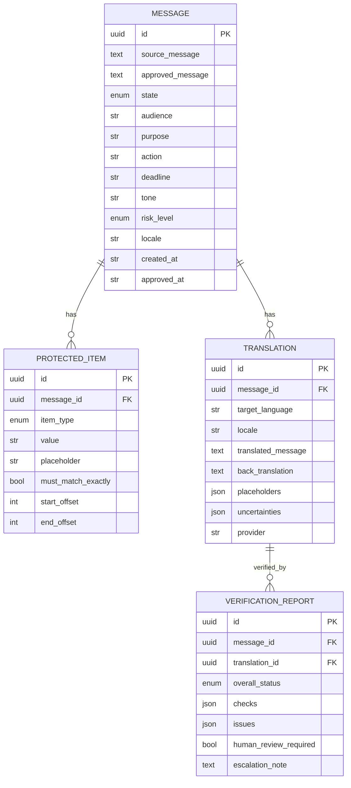

# Architecture

## 1. Design goals

1. **Verification over translation.** A translation is unverified until a fact
   map, a back-translation, and a risk level exist for it.
2. **Provider agnostic.** The application must never be coupled to one model
   vendor. Swapping providers is a configuration change, not a code change.
3. **A real human in the loop.** The plain-language revision must be explicitly
   approved before any translation is produced. The API enforces this.
4. **Fail closed.** Malformed AI output, an unapproved source, or a missing
   critical fact results in a blocked or `REVIEW_REQUIRED` outcome — never in a
   silent success.
5. **Testable offline.** Every layer except the AI provider must be verifiable
   without a network or an API key.

## 2. Layered structure

### Responsibility boundaries

| Package | May depend on | Must **not** |
| --- | --- | --- |
| `app/api` | services, schemas, dependencies | contain business logic or SQL |
| `app/services` | ai, verification, models, db | import FastAPI `Request`/`APIRouter` |
| `app/ai` | core, prompts, schemas | import services or models |
| `app/verification` | stdlib + core only | import ai, services, models, or FastAPI |
| `app/models` | sqlalchemy | import api or services |
| `app/schemas` | pydantic | import sqlalchemy |

## 3. The message state machine

Rules enforced in `app/services/message_service.py`:

- `POST /api/translations` raises `409 SOURCE_NOT_APPROVED` unless the parent
  message is in `APPROVED` state.
- Approval records who approved it and when, plus the exact text that was
  approved. Later translation always uses the *approved* text, never the
  original source.
- Rejection keeps the user inside the rewrite loop rather than silently
  translating.

## 4. Translation data flow

Placeholder masking is the key safety property: a date, URL, or phone number is
never *asked to be translated*. It is removed from the text, re-inserted
verbatim, and then checked.

## 5. Verification strategy

`app/verification/` performs checks at five accuracy layers.

| Layer | Implemented by | Deterministic? |
| --- | --- | --- |
| Factual | `fact_extractor` + `fact_comparator` | Yes (regex + value equality) |
| Semantic | AI-driven check + human confirmation | Partly |
| Pragmatic (tone) | AI tone assessment + human review | No |
| Terminological | glossary diff + human review | Partly |
| Functional | completeness diff (segments, links, labels) | Yes |

Value comparison normalises whitespace, case, and unicode, and understands that
`8:30 a.m.`, `08:30`, and `8:30 AM` are the same instant while `8:00` is not.
Locale-specific date ordering (`10/03/2026` vs `03/10/2026`) is compared
structurally by parsing day/month/year roles, not by string equality — an
ambiguous numeric date is escalated to `REVIEW_REQUIRED` rather than guessed.

## 6. Risk and escalation

`app/verification/risk_classifier.py` scores keyword hits per category and
returns the highest level triggered with its evidence. A user-supplied level
acts as a **floor** (you can raise risk, and the system may raise it for you).

`app/services/escalation_service.py` turns a `HIGH` classification into an
`ESCALATED` report state plus the required guidance string:

> Professional human translation or interpretation is recommended for this
> high-consequence message.

## 7. Data model

## 8. Extensibility

| Concern | How to extend |
| --- | --- |
| New language | Add an entry to `app/core/languages.py` (code, name, script, RTL flag, reading-level hint, glossary). No other change required. |
| New AI provider | Implement `AIProvider` in `app/ai/providers/` and register it in `app/ai/factory.py`. |
| New verification rule | Add a pure function in `app/verification/` returning a `FactCheck`; the assembler picks it up. |
| New risk category | Add keywords + guidance in `risk_classifier.py` / `escalation_service.py`. |

## 9. Error handling

All domain errors derive from `app/core/errors.py::AppError` and carry a stable
`code`, an HTTP `status`, and a **user-safe** message. A single exception
handler converts them to the standard envelope, logs the technical detail with
the request ID, and never returns a stack trace. Provider failures
(authentication, rate limit, timeout, malformed output) are translated into
`AIProviderError` subclasses by the provider layer, so services never import
vendor-specific exception types.
